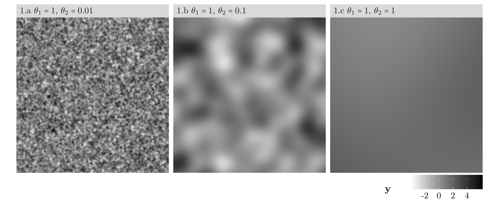
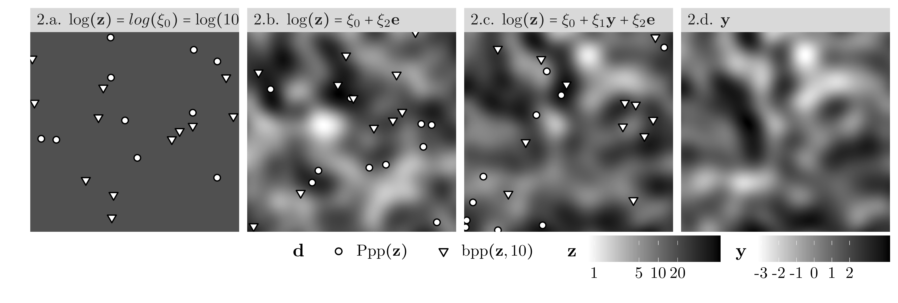
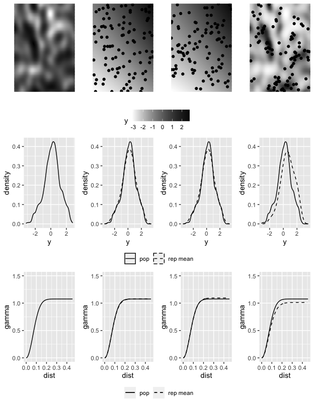

Informative Spatial Selection
=============================

`InformativeSpatialSelection` is an R package that contains the source
code to reproduce the graphs and simulations of the article
"InformativeSpatialSelection", by Daniel Bonnéry, Francesco Pantalone
and Giovanna Ranalli.

To install the package:
-----------------------

You will need to have Rtools installed, as well as the devtools package.

    devtools::install_github("DanielBonnery/InformativeSpatialSelection",dependencies=TRUE)

Produce the paper graphs and tables.
------------------------------------

### Load the package

    library(InformativeSpatialSelection)

### Figure 1.

    demo(figure1)

### Figure 2.

    library(InformativeSpatialSelection)
    demo(figure2)

### Figure 3.

    demo(figure3)

### Figure 4.

    library(InformativeSpatialSelection)
    demo(figure4)

### Figure 5.

    demo(figure5)

Details - demo of functions - selection.
========================================
